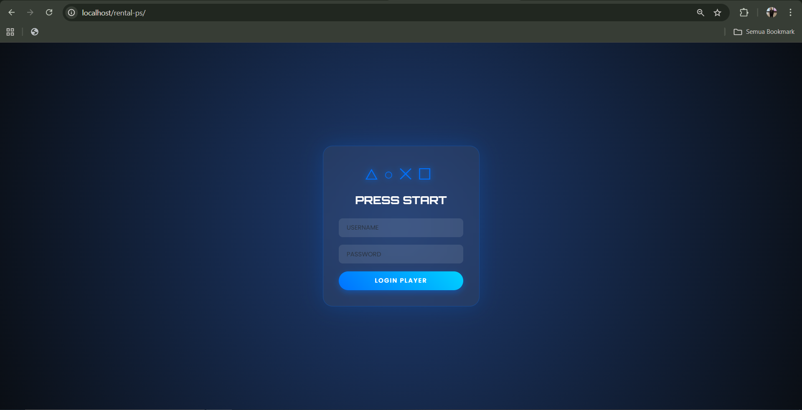
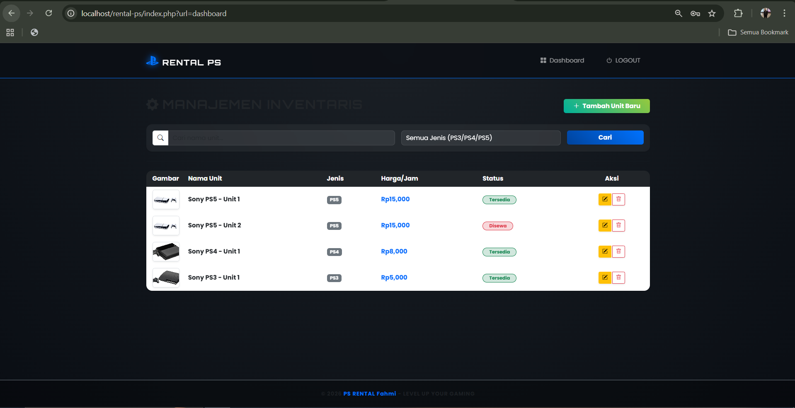
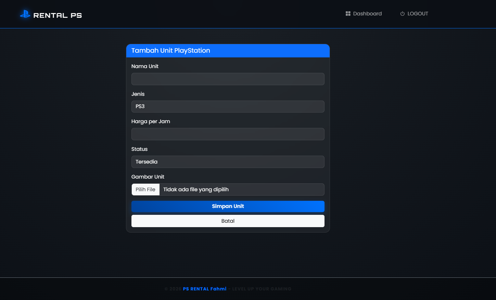
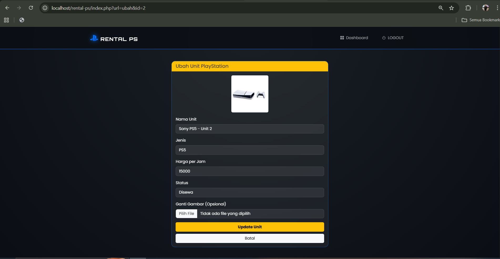
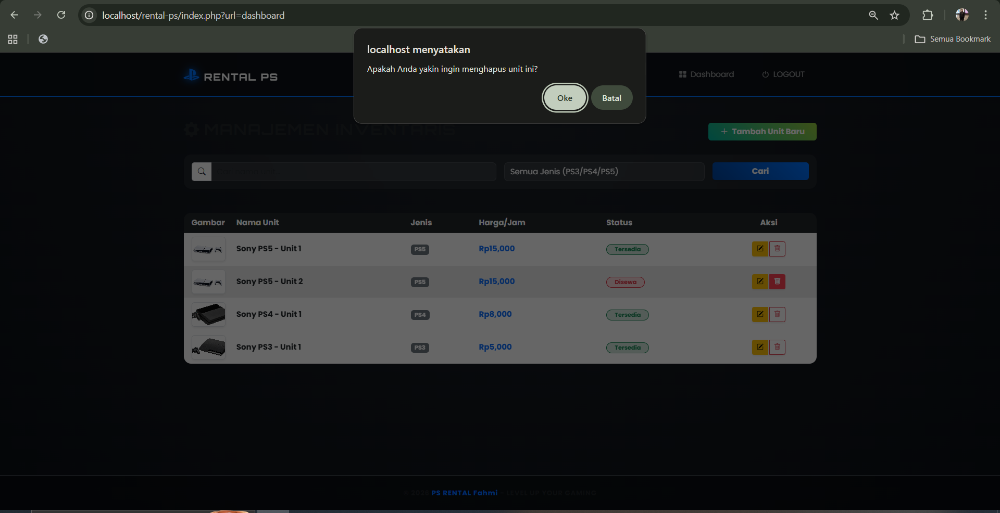
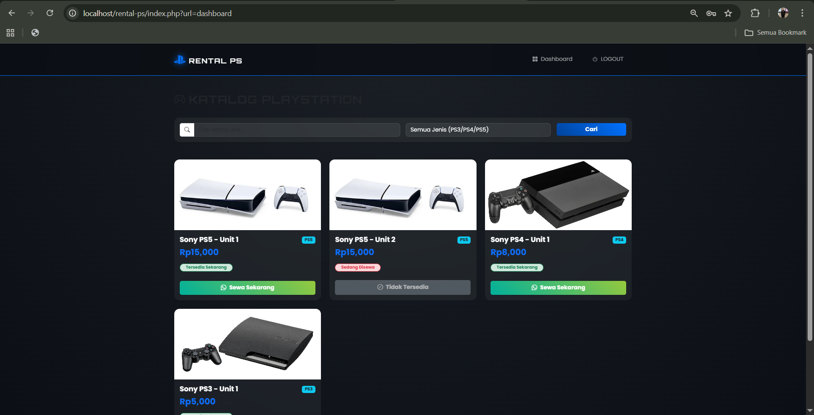
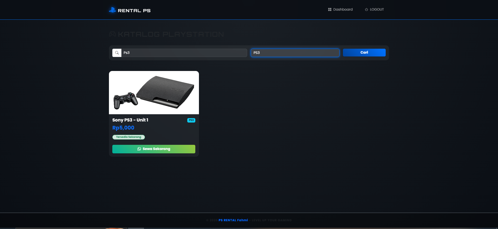
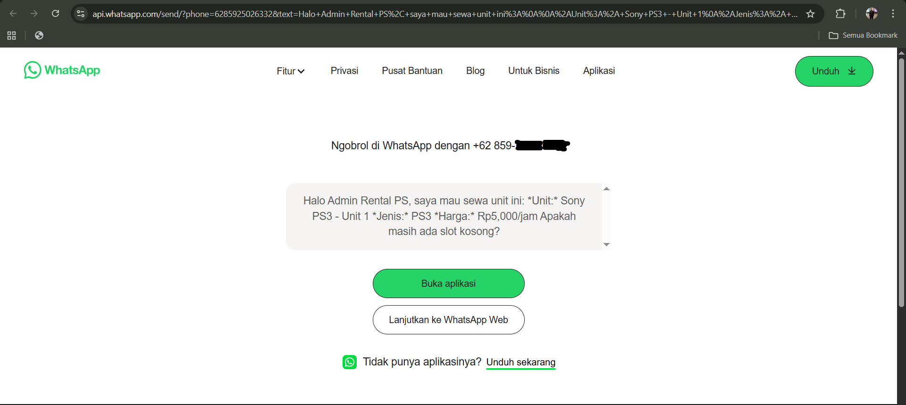

# Pemograman-web_UAS
Nama : Den Fahmi Satria <p>
Nim  : 312410523 <p>
Kelas: TI.24.A5 <p>
Mata Kuliah: Pemograman Web <p>
# 🎮 Sistem Informasi Manajemen Rental PS Fahmi
Pelanggan: <p>
Username : user_pelanggan <p>
Password : user123 <p>
_____________________________________________________________________________________________________________________________________________________________________________________________________
Admin: <p>
Username: admin_rental <p>
Password : admin123 <p>
[File-Vscode](rental-ps/). <p>
[File-Database](db_rental_ps.sql). <p>
```
rental-ps/
├── app/
│   └── models/
│       ├── Auth.php              # Logika autentikasi login
│       └── PlaystationModel.php  # Logika CRUD data PlayStation
├── config/
│   └── database.php              # Pengaturan koneksi database MySQL
├── public/
│   └── img/                      # Penyimpanan aset gambar unit PS
├── views/
│   ├── layout/
│   │   ├── header.php            # Template bagian atas & CSS Gaming
│   │   └── footer.php            # Template bagian bawah & JS Animasi
│   ├── ps/
│   │   ├── index.php             # Tampilan utama (Admin: Table, User: Card)
│   │   ├── tambah.php            # Form tambah unit (Admin)
│   │   └── ubah.php              # Form edit unit (Admin)
│   └── login.php                 # Halaman utama login
├── index.php                     # Front Controller & Routing Utama
├── logout.php                    # Proses pembersihan session
└── delete.php                    # Proses penghapusan data
```

Sistem ini dirancang untuk mendigitalisasi proses manajemen unit PlayStation dan mempermudah pelanggan dalam melakukan pemesanan melalui antarmuka web yang modern dan responsif.

## Penjelasan Fitur Utama

Berikut adalah detail fungsionalitas sistem yang telah diimplementasikan:

### 1. Sistem Autentikasi Multi-Role
Aplikasi memiliki gerbang masuk (Login) yang membedakan hak akses antara **Admin** dan **User**. 
- **Admin**: Memiliki kontrol penuh atas stok dan inventaris.
- **User**: Hanya dapat melihat katalog dan melakukan pemesanan.
 <p>


### 2. Dashboard Admin (Manajemen Inventaris)
Halaman khusus Admin yang didesain menggunakan komponen **Table**. Fitur ini memungkinkan Admin untuk mengelola data dengan cepat.
 <p>
- **Tambah Unit**: Form input untuk menambah koleksi PS lengkap dengan fitur upload gambar.
   <p>
- **Ubah Data**: Memperbarui harga, jenis, atau status unit (tersedia/disewa).
   <p>
- **Hapus Data**: Menghapus unit yang sudah tidak layak pakai atau terjual.
 <p>


### 3. Katalog User (Responsive Cards)
Halaman bagi Pelanggan yang menampilkan daftar unit dalam bentuk **Card**.
- **Visual Menarik**: Gambar unit tampil besar untuk menarik minat penyewa.
- **Status Real-time**: Label status otomatis berubah warna (Hijau untuk Tersedia, Merah untuk Disewa).
- **Responsivitas**: Tampilan otomatis menyesuaikan saat dibuka di handphone (Mobile Friendly).
 <p>


### 4. Filter Pencarian Canggih
Fitur untuk membantu pengguna menemukan unit spesifik tanpa harus mencari satu per satu.
- **Pencarian Nama**: Mencari berdasarkan merk atau nama unit.
- **Filter Kategori**: Menyaring daftar berdasarkan jenis konsol (PS3, PS4, atau PS5).
 <p>

### 5. Integrasi Pemesanan WhatsApp
Sistem ini memangkas proses transaksi yang rumit dengan menghubungkan pelanggan langsung ke Admin via WhatsApp.
- **Pesan Otomatis**: Saat tombol "Sewa Sekarang" diklik, sistem menyusun teks berisi nama unit, jenis, dan harga secara otomatis.
 <p>


## Alur Kerja Sistem (Workflow)
1. **Login**: Pengguna masuk ke sistem.
2. **Routing**: `index.php` mengarahkan pengguna ke dashboard sesuai role.
3. **Interaksi**: User mencari unit, Admin mengelola data di database MySQL.
4. **Output**: Informasi ditampilkan melalui template `header.php` dan `footer.php`.

---

## Kebutuhan Sistem (Prerequisites)
- PHP >= 8.0
- MySQL Database
- Web Server (XAMPP / Laragon)
- Koneksi Internet (untuk memuat library Bootstrap via CDN)
